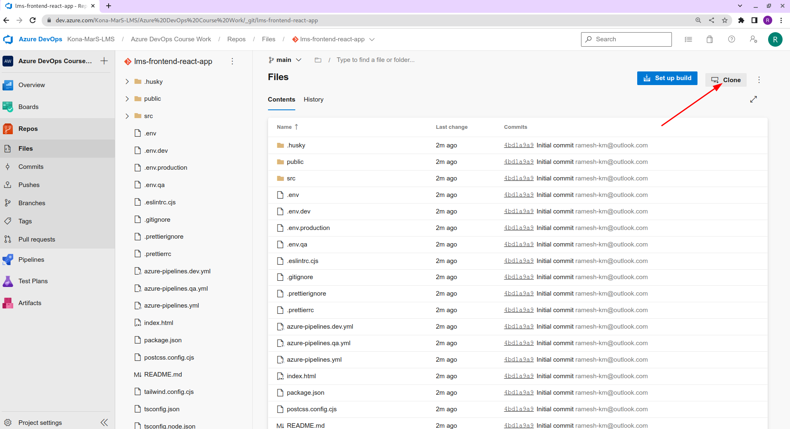

# Clone a git repo from Azure Repos

## Prerequisites

- Install git locally. [Download from here.](https://git-scm.com/)

## Steps

- Open the repo you want to clone. [Example repo.](https://dev.azure.com/Kona-MarS-LMS/Azure%20DevOps%20Course%20Work/_git/lms-frontend-react-app)

- Click on clone option and generate `GIT Credentials`

- Open git bash (windows), terminal of your choice (mac, linux) and enter below command to clone the above repo.

`git clone <Repo Link> `

`git clone https://Kona-MarS-LMS@dev.azure.com/Kona-MarS-LMS/Azure%20DevOps%20Course%20Work/_git/lms-frontend-react-app`

Enter above generated password when prompted for it.

- Open the project and check git status using below commands.

`cd <project directory name>`

`cd lms-frontend-react-app # Move into project directory`

`git status # Git status`
