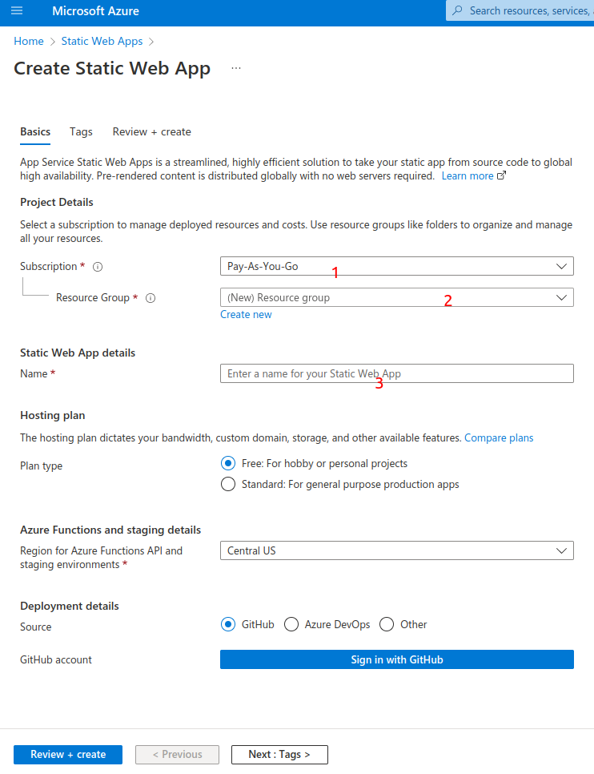
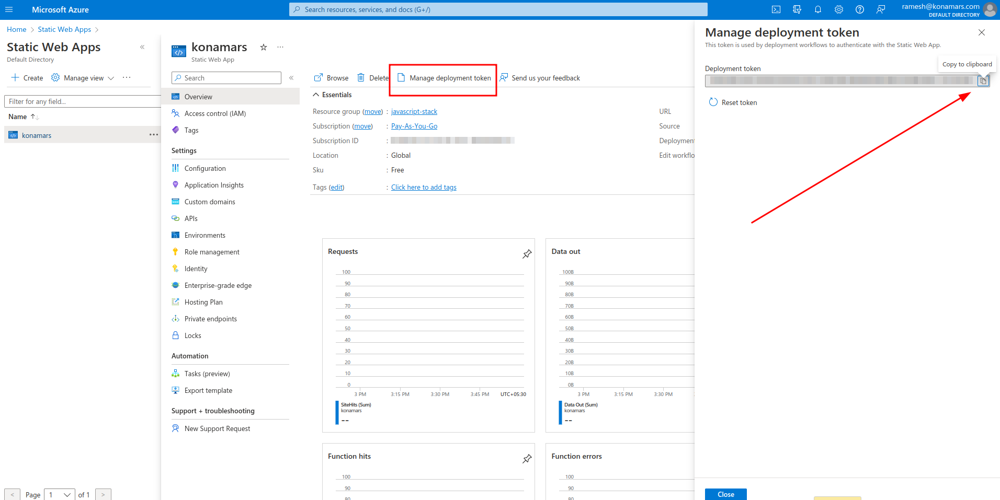

# Create static webapp on azure

## Prerequisites

- Access to azure cloud portal.

## Steps

- Open azure static webapps page. [Static Web Apps - Microsoft Azure](https://portal.azure.com/#view/HubsExtension/BrowseResource/resourceType/Microsoft.Web%2FStaticSites)

- Fill required fields and leave rest of them with default values.



- Visit the created static web app resource page and copy the deployment token for using it in CI CD pipelines.



- Add below yml file (filename: `azure-pipelines.yml`) to project root folder. Please refer the screenshots for Azure Static Web App option details.


- use "Deploy Azure Static Web App" task from "Show assistant" for this task.

- Parameters for above task
    - App build command: `npm run build`
    - Output location: `dist`
    - Skip Api Build (should be checked)
    - Build timeout in minutes: 15
    - Azure Static Web Apps api token: (Value copied from portal.azure.com)
    - Production Branch (main)

 

```yml
  # Starter pipeline
  # Start with a minimal pipeline that you can customize to build and deploy your code.
  # Add steps that build, run tests, deploy, and more:
  # https://aka.ms/yaml

trigger:
  - main

pool:
  vmImage: ubuntu-latest

steps:
  - script: echo Hello, world!
    displayName: "Run a one-line script"

  - script: |
      echo Add other tasks to build, test, and deploy your project.
      echo See https://aka.ms/yaml
    displayName: "Run a multi-line script"

  - task: AzureStaticWebApp@0
    inputs:
      app_build_command: "npm run build"
      output_location: "dist"
      skip_api_build: true
      is_static_export: false
      build_timeout_in_minutes: 15
      production_branch: "main"
      azure_static_web_apps_api_token: $(deployment_token)
```

After committing this file to repo, azure will automatically pick this file and run the build & deploy steps as part of this pipeline.