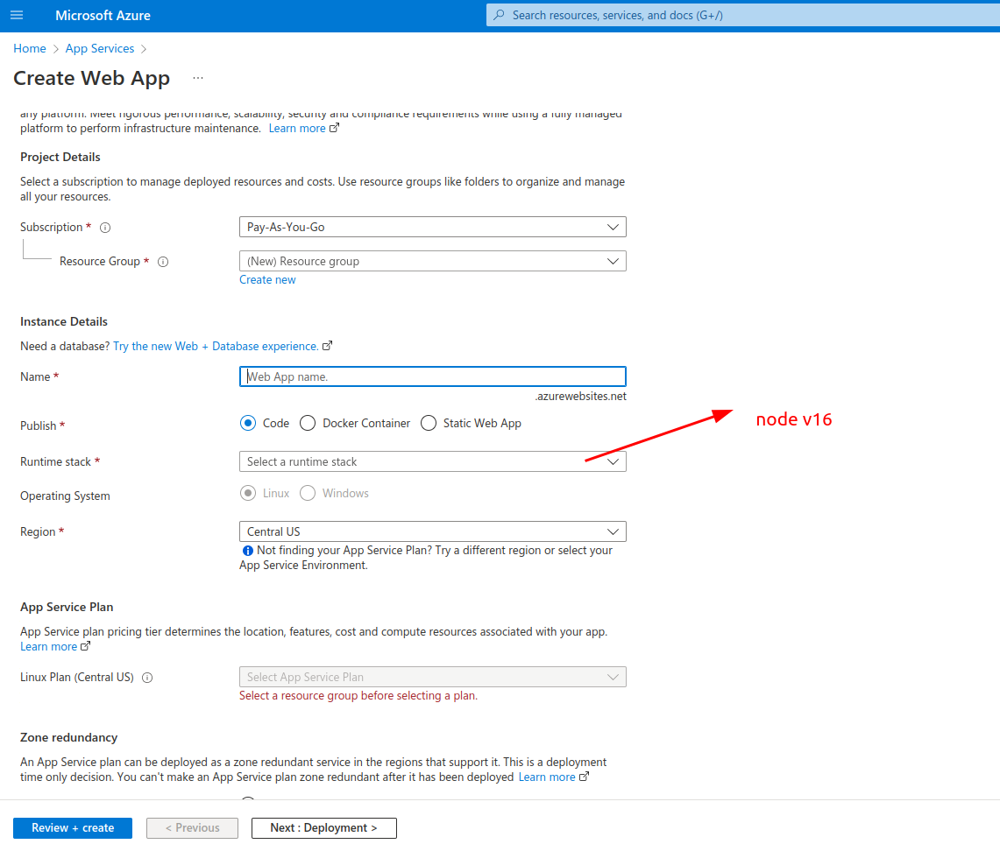
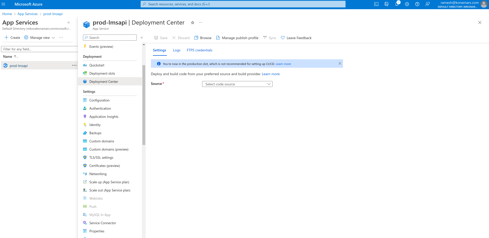
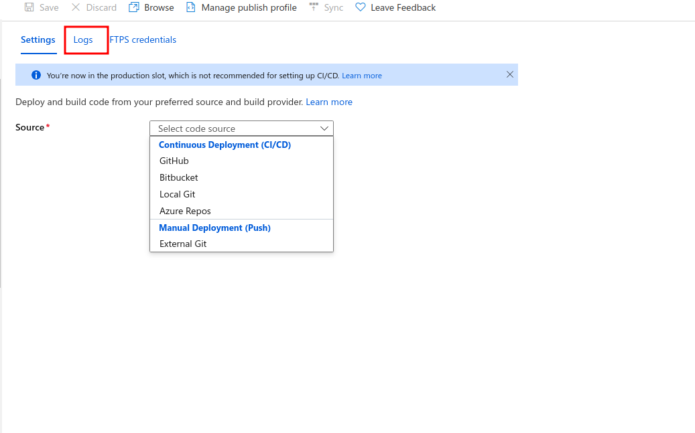

# Deploy a nodejs app using Azure App Services.

## Creating app on azure portal

- Create a nodejs app using azure app services on azure portal. [App Services - Microsoft Azure](https://portal.azure.com/#view/HubsExtension/BrowseResource/resourceType/Microsoft.Web%2Fsites).
- Fill required fileds and make sure to select node 16 as runtime environment.
  

## Code repo integration for deployment

- Open resource created in above step and go to deployment center tab.

- Fill the details of your git repo and hit save.
- Under "Logs" tab you will find the automatic deployment settings.
  
  