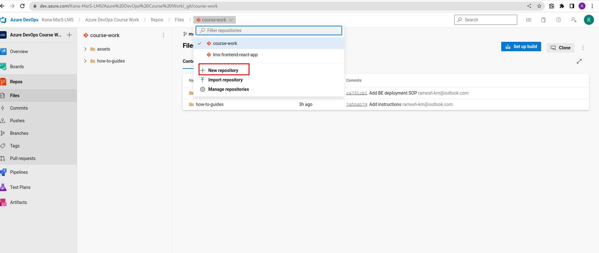
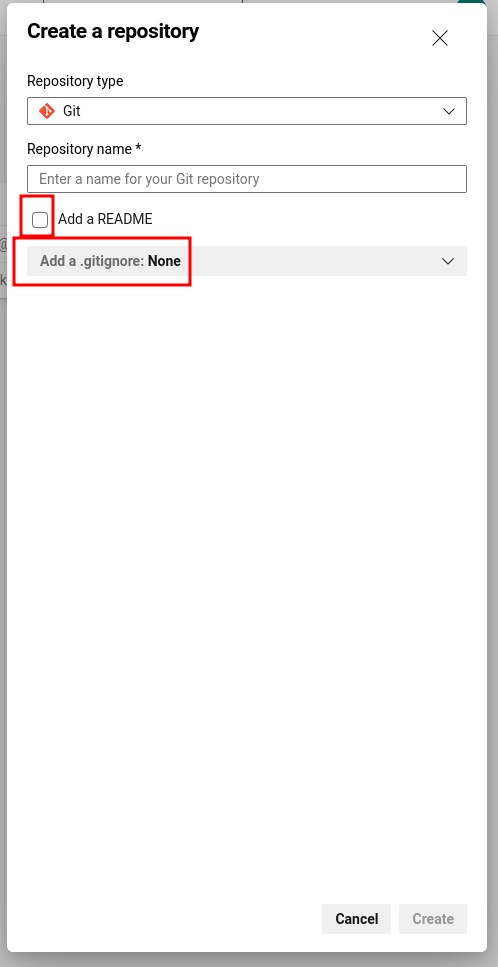
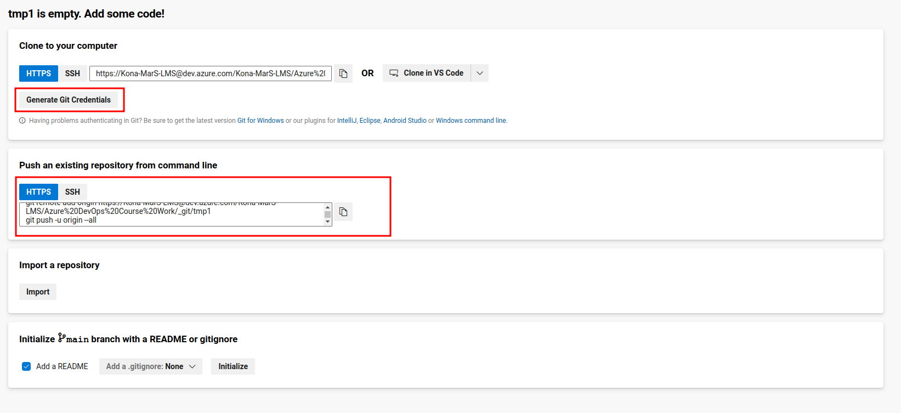
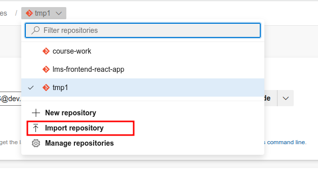
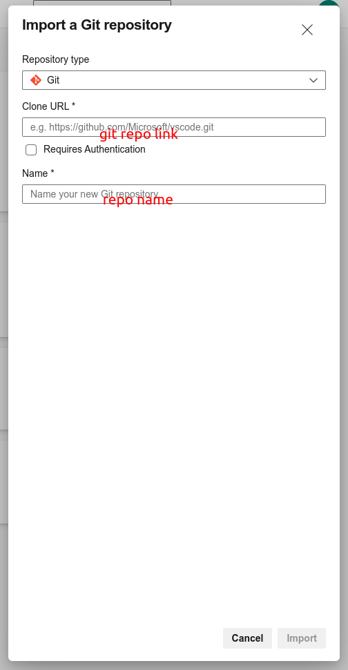

# Publish code to azure repos.

## Steps

### From local system

- Clone lms repo from github. [follow these steps for it](Clone-a-git-repo.md)
- Delete `.git` directory from the root folder `konamars-webapp`
- Open [azure repos page](https://dev.azure.com/Kona-MarS-LMS/Azure%20DevOps%20Course%20Work/_git/course-work) and create new repo without readme file.




- Generate git credentials.



- Enter the generated commands under `Push an existing repository from command line` tab.

```
git remote add origin https://Kona-MarS-LMS@dev.azure.com/Kona-MarS-LMS/Azure%20DevOps%20Course%20Work/_git/tmp1
git push -u origin --all
```

### Publish with git repo link.

- Click on import repo


- Give `https://github.com/ramesh-km/konamars-webapp.git` in clone URL field.
