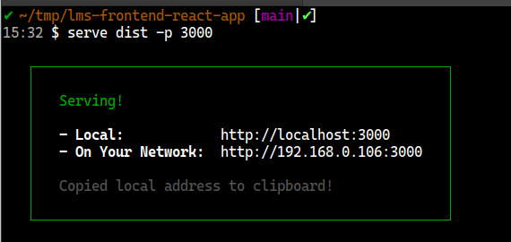

# Run front end react app locally

## Prerequisites

- Node & NPM installed locally.
  
[Node.js](https://nodejs.org/en/)

[GitHub - nvm-sh/nvm: Node Version Manager - POSIX-compliant bash script to manage multiple active node.js versions](https://github.com/nvm-sh/nvm)

## Steps

- Open project directory in git bash / terminal
- Install npm dependencies with `npm install` command.
- Build project using `npm run build`
- Install any static file server. Eg: `npm install -g serve`
- Run project using `serve dist/ -p 3000` (dist will be created in project root directory in build step).
- Open the url mentioned in above command output to see the running application.

